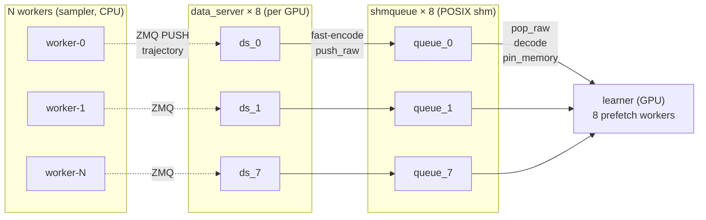

# shmqueue

**高吞吐共享内存消息队列中间件** —— 单机多进程之间以最高吞吐交换批量数据（numpy 数组 / 字节）。

---

## 1. 背景与动机

本项目从一个强化学习训练框架（rl_framework）的 learner 侧数据通路中抽象而来。原框架中存在一条 **data → queue → gpu** 链路：

```
DataServer 进程:  recv(ZMQ) → 解压 → replay buffer → 采样 → fast-encode → push 到共享内存队列
                                                                          │
                                   POSIX SharedMemoryQueue (环形缓冲 + fcntl 锁) ◀── 跨进程
                                                                          │
LearnerServer 进程: prefetch worker 线程 pop_raw → fast-decode(零拷贝) → pin_memory → deque → H2D → GPU 训练
```

### 1.1 worker – queue – learner 对应关系

多 worker（sampler，CPU）经 ZMQ 把 trajectory 推给 data_server；data_server 采样后 fast-encode 入 shmqueue；learner（GPU）的 prefetch worker 从 queue pop、pin、送 GPU。对应关系：

- **worker → data_server**：ZMQ PULL，**不绑定**——任一 worker 的数据可被任一 data_server 接收（负载均衡）
- **data_server → queue**：**1 : 1**——每 GPU 有 `data_server_number_per_device`(=8) 个 data_server，每个独占一个 shmqueue（`{exp}_queue_{flat_idx}`）
- **queue → learner**：**N : 1**——每 GPU 1 个 learner，消费该 GPU 的全部 8 个 queue（8 个 prefetch worker 线程，一 queue 一消费者，无 fcntl 锁争用）
- **多 GPU / 多机**：每 GPU 重复该结构；learner 间走 DDP（NCCL）同步梯度，与 shmqueue 无关



> 图中虚线（worker → data_server 的 ZMQ）在 shmqueue 范围**之外**；实线（data_server → queue → learner）是 shmqueue 覆盖的 producer/consumer 数据通路。

这条通路的核心机制 —— **POSIX 共享内存环形队列 + 零拷贝 flat-binary 编解码 + producer/consumer 流水线** —— 本质是通用的进程间高吞吐数据交换，与 RL 业务（environment / algorithm / model / replay buffer）无关。但它原本深耦合在 RL 框架里：

- `DataServer` 依赖 `get_environment` / `create_buffer` / `get_data_class`
- `LearnerServer` 依赖 `get_algorithm_cls` / `create_model` / DDP
- 无法脱离 `rl_framework` 独立运行、独立 benchmark、独立优化

**shmqueue 把这条数据通路的核心抽成独立中间件**，去掉一切 RL 依赖，使其可独立部署、可量化基准、可针对性优化，目标是 **producer 端与 consumer 端之间的数据交换吞吐最大化**。

> **范围边界**：shmqueue 只覆盖 data-server ↔ learner-server 之间的共享内存队列段。worker → data-server 的 ZMQ 收发**不在**本中间件范围内（那是上层应用的事）。两端"连接"到 shmqueue，shmqueue 不关心数据怎么来、到哪去。

---

## 2. 定位

一个**单机、跨进程、零拷贝、高吞吐**的消息队列中间件，面向**单台机器内**需要大批量数据交换的场景：

- 多个 producer 进程往同一队列写批量数据（采样、推理结果、传感器数据…）
- 多个 consumer 进程从队列读（GPU 训练、落盘、下游处理…）
- 数据以 numpy 数组为主（科学计算 / ML 场景的典型负载）
- 追求**吞吐优先**，延迟其次

**不适用场景**：跨机器通信（需配合 ZMQ/gRPC 等网络层，由上层组合）；强持久化（数据驻留内存，进程退出即失）；事务/路由等复杂 MQ 语义。

---

## 3. 设计目标

### 3.1 核心目标：吞吐最大化

producer → consumer 的稳态吞吐（msg/s 与 MiB/s）在以下配置下达到硬件理论上限：
- 1P1C（单生产单消费）
- NP-MC（多生产多消费，N 个 producer、M 个 consumer 共享同一队列或一组队列）

衡量指标：
- **端到端吞吐**：consumer 每秒收到的数据量（MiB/s、batch/s）
- **队列开销占比**：push+pop+锁 总耗时占端到端延迟的比例（目标 < 10%）
- **背压行为**：producer 快于 consumer 时的丢批率 / 阻塞策略

### 3.2 功能性需求

| 需求 | 说明 |
|------|------|
| **跨进程** | producer 与 consumer 是独立进程（fork/spawn），无父子关系要求；通过命名 POSIX 共享内存段寻址 |
| **零拷贝** | consumer 侧 `decode(copy=False)` 返回指向共享内存的 view，避免数据复制；producer 侧 `tobytes()` 单次拷贝入队 |
| **fast 编解码** | 对 `dict[str, numpy.ndarray]` 用 flat-binary 格式（4B 长度头 + JSON meta + 拼接裸字节），比 pickle 快 5-10× |
| **pin_memory 流水线** | consumer 后台线程把 numpy → `torch.from_numpy().pin_memory()`（C++ ATen，释放 GIL），主线程后续 `.cuda(non_blocking=True)` 走真异步 DMA |
| **满队列背压** | `push_raw` 满时返回 `False`；支持 `soft_limit`（深度超阈值即拒写）；可选阻塞/超时模式 |
| **监控** | Monitor 进程 attach 队列，定时报告 depth / pushed / popped / utilization |
| **可选 metrics 出口** | 监控指标可经 ZMQ PUSH 转发到外部日志服务（可选，不强制依赖 pyzmq） |
| **优雅生命周期** | 首个 producer/supervisor `create=True` 创建并拥有 shm 段，退出时 `unlink`；其余 attach，60s 重试等待段就绪 |

### 3.3 非功能性需求

- **零外部硬依赖**：核心（queue + codec + producer + consumer）仅依赖 `numpy`；prefetch 的 `pin_memory` 路径在 import torch 时启用，无 torch 时降级为不 pin；监控的 ZMQ 转发在 import pyzmq 时启用。
- **不依赖任何框架**：不 import rl_framework / 不读 RL config；所有参数（队列名、maxsize、slot_size、ip:port）由构造函数传入。
- **可独立运行**：`import shmqueue` 在干净 venv（仅装 numpy）即可工作。
- **可量化**：自带 benchmark，能脱离任何业务上下文测吞吐/延迟。

---

## 4. API 设计

```python
from shmqueue import Producer, Consumer, Monitor

# ---------- producer 端（原 data server 侧） ----------
p = Producer.connect(
    name="exp_queue_0",
    maxsize=400,
    slot_size=512 * 1024 * 1024,   # 512 MiB / slot
    create=True,                    # 首个创建者拥有并负责 unlink
)
# push 一个 batch（dict[str, ndarray]）—— 自动 fast-encode 后入队
p.push({"obs": obs_array, "action": action_array, "reward": reward_scalar})
# 或跳过 encode，直推已序列化字节
p.push_raw(raw_bytes)

# ---------- consumer 端（原 learner server 侧） ----------
c = Consumer.connect(
    name="exp_queue_0",
    maxsize=400,
    slot_size=512 * 1024 * 1024,   # 必须与 producer 一致
)                                   # attach（create=False，60s 重试）

# 同步模式
batch = c.pop()                     # → dict[str, ndarray]，空时 None

# 流水线模式（推荐高吞吐）
c.start_prefetch(pin_memory=True, workers=8, qsize=50)
batch = c.next(timeout=5.0)         # 从 prefetch deque 取，已 pin 好
c.stop_prefetch()

# ---------- 监控 ----------
m = Monitor.attach("exp_queue_0")
m.run()                             # 阻塞，每 5s 打印 depth/pushed/popped/util
```

**队列寻址与多队列**：队列由 `name` 标识（POSIX shm 段名）。多 GPU / 多 data_server 场景用一组队列 `{prefix}_queue_{idx}`，由上层编排（与原 rl 的 `experiment_name_queue_{flat_idx}` 一致，但命名逻辑上移到调用方）。

---

## 5. 模块结构

```
shmqueue/
├── README.md                 # 本文档（需求说明）
├── pyproject.toml
├── shmqueue/
│   ├── __init__.py           # 导出 Producer/Consumer/SharedMemoryQueue/Monitor
│   ├── queue.py              # SharedMemoryQueue: POSIX shm ring buffer + fcntl flock
│   ├── codec.py              # encode_batch / decode_batch (flat-binary, 零拷贝)
│   ├── producer.py           # Producer: connect + push/push_raw
│   ├── consumer.py           # Consumer: connect + pop / start_prefetch / next
│   ├── monitor.py            # Monitor: attach + 周期性 depth/pushed/popped
│   └── base.py               # LogSink: 可选 ZMQ PUSH metrics 转发
├── benchmarks/
│   ├── bench_throughput.py   # 1P1C / NP-MC 端到端 msg/s, MiB/s
│   ├── bench_codec.py        # encode/decode μs/batch vs pickle
│   ├── bench_latency.py      # push→pop 单条 p50/p99
│   └── data_source.py        # 测试数据源: mock / zmq / file (见 §9.0)
└── tests/
    ├── test_queue.py         # 基础 push/pop、满队列、多进程 attach、codec 往返
    ├── test_zmq_source.py    # ZMQ 网络发送 → shmqueue 链路
    └── test_file_source.py   # 本地文件 IO 读取 → shmqueue 链路
```

---

## 6. 优化路线（实现后逐步推进，量化对比）

搬运后**先保持与原 rl 行为一致**（保证正确性 + 可回灌验证），再按下列方向优化，每个优化都由 benchmark 量化：

1. **锁优化（首要）**：当前 `SharedMemoryQueue` 每次 push/pop 都 `fcntl.flock(LOCK_EX)` 整个 ring，多 producer / 多 consumer 时全局串行争用。
   - 方向 A：lock-free，meta（write/read/count）用原子 CAS 更新
   - 方向 B：per-slot 锁分片，降低争用粒度
   - 基准：1P1C / 4P4C 吞吐对比

2. **编解码**：`encode_batch` 已用 `tobytes()` 零拷贝拼接、`decode_batch` 已 `np.frombuffer(copy=False)`。
   - 方向：header 用 struct 替代 JSON；支持 torch tensor 直传免 numpy 中转；支持直接写入 shm slot 免一次中间 bytes

3. **prefetch 流水线**：`pin_memory` 释放 GIL 是已有优势。
   - 方向：调 `workers` 数与 `prefetch_qsize`；测 consumer 饥饿率；prefetch 直接 H2D（绕过 deque）

4. **背压策略**：`push_raw` 满即返回 False。
   - 方向：阻塞/超时模式；producer 侧自适应采样率

---

## 7. 前端监控面板（监控与可视化）

### 7.1 前后端拆分

| 层 | 职责 | 产出 |
|----|------|------|
| **后端**（shmqueue 核心） | queue / codec / producer / consumer / monitor + metrics 采集 | 暴露 metrics（HTTP API 或经 `LogSink` ZMQ PUSH 到外部时序库），自身不含 UI |
| **前端**（监控面板，独立仓库/独立部署） | 消费 metrics，可视化、瓶颈定位、理论上限对比 | Web 面板（实时图表） |

后端只管"采集与暴露指标"，前端只管"呈现与诊断"。两边经 metrics 接口解耦，前端可独立迭代。

### 7.2 面板核心目标：快速定位问题出在哪

一眼看出端到端吞吐被哪一环卡住。数据通路拆成可观测的 stage 链：

```
数据源(recv/zmq/file) → encode → push → queue_wait → pop → decode → pin_memory → h2d → algo(GPU)
```

面板提供**stage 耗时瀑布图**（每段占端到端时间的比例）。占比异常的 stage 即瓶颈：
- `recv/zmq/file` 占比高 → 网络/磁盘 IO 瓶颈
- `encode/decode` 占比高 → 序列化瓶颈
- `push/pop + queue_wait` 占比高 → 队列锁争用（fcntl）瓶颈
- `h2d` 占比高 → 未 pin / 未 non_blocking 的 H2D 瓶颈
- `algo` 占比高 → GPU 算力瓶颈（已达理论上限，数据通路已不是瓶颈）

### 7.3 理论上限 vs 实际达成（核心可视化）

面板顶部一个**达成率仪表盘**，回答"我们离极限有多远"：

| 指标 | 定义 | 举例 |
|------|------|------|
| **理论上限** | 零数据开销 baseline：数据不经队列/网络/磁盘，直接喂 GPU，GPU 纯算力每分稳定更新步数 | 10 分钟稳定更新 4000 次 ≈ 6.67 step/s |
| **实际达成** | 端到端（数据源 → shmqueue → GPU）实测每分更新步数 | 经各种优化后达到 3800 次 ≈ 6.33 step/s |
| **达成率** | 实际 / 理论 | 3800/4000 = 95% |
| **损耗分解** | 理论与实际的差距被哪几环吃掉（瀑布图叠加） | 队列锁 2% + 序列化 1% + 数据源 IO 2% = 5% |

理论上限用 `--source mock` 且 queue 短路（producer 直接调 consumer 回调，不经 shm）测得，作为 100% 基线。每接入一种真实数据源（zmq / file:stream / file:sample）或每项优化（lock-free、零拷贝、prefetch），面板实时显示达成率变化，量化每步优化收益。

### 7.4 面板可视化元素

- **实时折线**：吞吐（step/s、MiB/s）、队列深度、达成率 随时间
- **stage 瀑布图**：各 stage 耗时占比（定位瓶颈主图）
- **多数据源对比柱状**：mock / zmq / file:stream / file:sample 端到端吞吐并排
- **多队列热力图**：一组队列（如 8 个）的深度/utilization，发现不均衡
- **达成率仪表盘**：实际/理论 + 损耗分解

### 7.5 技术栈（建议）

- 后端 metrics：FastAPI HTTP `/metrics`（JSON），或复用 `LogSink` → ZMQ PUSH → Prometheus → Grafana 数据源
- 前端：React + ECharts（或直接 Grafana dashboard，若走 Prometheus 路线）
- 首期可先做 Grafana dashboard（后端 metrics 转 Prometheus 格式，零前端开发量），后续再自建 Web 面板做更精细的瀑布图/达成率仪表盘

---

## 8. 资源均衡与动态保护

shmqueue 运行在单机多进程环境，与 GPU 训练、系统进程**共享**同一台机器的 CPU 与内存。任何单一环节都不允许把 CPU 或内存吃满——producer 抢光 CPU 会拖慢 consumer、队列占满内存会 OOM 整机。本节定义资源均衡策略：**支持运行时动态调节，但以多重保护兜底，确保任何情况下都不会直接打满机器**。

下列机制均来自 rl_framework 已有实现（搬运后去 RL 化、参数化），来源标注于各条。

### 8.1 内存保护

| 机制 | 行为 | 来源 |
|------|------|------|
| **auto maxsize** | 队列容量按物理内存预算自动计算，**留 20% 余量**：`shm_budget = RAM × 0.8`，`maxsize = clip(shm_budget / 队列数 / slot_size, 10, 10000)`。不靠人估，按实际 RAM 反推 | `shared_memory_queue.compute_auto_maxsize` |
| **total_shm 显式预算** | 创建队列前打印总量 `total_shm = dev_num × ds_per_gpu × maxsize × slot_size`（GiB），超 RAM 即拒绝创建。让内存占用一目了然、可审计 | `supervisor._create_shm_queues` |
| **slot 容量硬限** | 单 batch 序列化后超 `slot_size` 直接抛 `ValueError` 拒绝入队——不让一条异常大 batch 把整个 slot 撑爆、连锁拖垮 ring | `SharedMemoryQueue.push_raw` |
| **soft_limit 背压** | 队列深度超过 `maxsize × soft_limit_ratio` 即拒写（`push_raw` 返回 `False`），producer 自行降速。**满队列时丢批而非堆积内存**，是防 OOM 的第一道闸 | `push_raw` soft_limit 分支 |

四道闸层层兜底：容量按 80% RAM 自动算（不会一开始就占满）→ 总量打印可审计 → 单条硬限防异常数据 → 软限背压防 producer 失速堆积。

### 8.2 CPU 保护

| 机制 | 行为 | 来源 |
|------|------|------|
| **线程数显式上限** | 每进程 `OMP/MKL/OPENBLAS_NUM_THREADS` 受控：consumer（learner）≤8、producer（data_server）builder 线程数受配置约束、辅助服务（log/model server）=2。**不任由 numpy/torch 把所有核占满** | learner/data_server env |
| **单轮 recv 上限** | producer 每轮最多 recv `_MAX_RECV_PER_CYCLE=256` 条即让出，防止一直 recv 把 CPU 占满、饿死 encode/push 等其他逻辑 | `data_server._MAX_RECV_PER_CYCLE` |
| **一 queue 一消费者** | prefetch worker 数 = 队列数，不超额起线程；consumer 侧并发度与队列数对齐，避免无谓线程争用 | learner prefetch workers |

CPU 保护思路：**所有并发源都有显式上限**（线程数、单轮处理量、worker 数），不存在"按需无限扩张"的路径。

### 8.3 动态调节（运行时可调，但受保护阈值约束）

支持运行时调整，而非写死：

- **soft_limit 运行时可调**：背压阈值 `soft_limit_ratio` 可在不重建队列的前提下调整。consumer 跟不上、queue_rejects 升高时调高 soft_limit 增加缓冲；内存吃紧时调低 soft_limit 提前丢批保内存。
- **prefetch_qsize 可调**：consumer 饥饿（deque 常空）则调大 `learner_prefetch_queue_size`（默认 50）；内存紧则调小。
- **自适应 producer 速率**：`queue_rejects` 持续升高 → 传导 producer 降采样率/降并发（背压传导，而非无脑往队列塞）。

**关键约束**：动态调节的上下限由 §8.1/§8.2 的硬保护界定——soft_limit 再调高也不能突破 `maxsize`（auto maxsize 已按 80% RAM 封顶），线程数再调也受显式上限约束。**动态只在该区间内滑动，绝不能突破硬保护把机器打满。**

### 8.4 错误熔断与恢复（防异常循环烧 CPU）

异常情况下不能无限空转/无限重启把 CPU 烧满：

| 机制 | 行为 | 来源 |
|------|------|------|
| **连续错误熔断** | producer `_ERROR_BURST_LIMIT=10`、consumer `_MAX_CONSECUTIVE_ERRORS=10`：连续异常达限即退出，不无限空转烧 CPU | data_server / learner_server |
| **restart 指数退避** | 重启间隔 `1 → 2 → 4 → … → 60s` 封顶（`_BASE=1, _MAX=60`），稳定运行 `_RESET_SEC=300s` 后归零。崩溃循环不会高频重启打满 CPU | `supervisor.Backoff` |
| **重启次数硬上限** | `_MAX_CONSECUTIVE_RESTARTS=20` 后标记 unhealthy 不再自动重启——防止永久故障的崩溃-重启循环持续吃 CPU | `supervisor._MAX_CONSECUTIVE_RESTARTS` |
| **warmup** | `warmup_time` 内 consumer 不启动训练/推理，等数据积压到稳态再开始，避免冷启动抖动期的资源尖峰 | learner warmup_deadline |

### 8.5 监控联动

以上所有阈值与水位均经 §7 监控面板暴露并告警：

- **内存**：`shm_gib`（实际占用）/ `total_ram`（物理内存）/ auto maxsize 推算值，接近 80% 预算告警
- **CPU**：`cpu_threads`（实际线程数）/ 单核利用率，超阈值告警
- **背压**：`queue_rejects` / `queue_depth` / `utilization`，rejects 持续非零 → 触发 §8.3 动态调节或告警人工介入
- **稳定性**：`restart_count` / `consecutive_errors`，触发熔断或达重启上限即红色告警

**总结**：内存四道闸（auto maxsize / total_shm 审计 / slot 硬限 / soft_limit 背压）+ CPU 三道闸（线程上限 / 单轮上限 / 一队列一消费者）+ 动态调节受硬保护约束 + 异常熔断防循环 = **多重保护，动态可调但绝不打满机器**。

---

## 9. 验证计划

### 9.0 测试数据源（统一接口）

benchmark 与测试的 **producer 端数据来源**支持三类，用 `--source mock|zmq|file` 切换，统一 `DataSource` 抽象（`__iter__` 产出 `dict[str, ndarray]` batch）：

| 模式 | 说明 | 模拟的真实场景 |
|------|------|----------------|
| `mock` | 内存中即时生成随机 numpy batch | 纯压测队列/codec 上限，排除 IO 干扰 |
| `zmq` | 启动 ZMQ PULL socket，从外部 ZMQ PUSH 接收 batch（字节/lz4 压缩） | **网络输入**：模拟真实 worker → data_server 的网络推流（多 worker 经网络推数据） |
| `file` | 从本地磁盘读取预先生成的 batch（`.npy` / `.npz` / pickle），**两种子模式**见下 | **本地 IO 输入**：与 zmq 相反，数据来自磁盘而非网络 |

- `mock`：基准对照组，衡量队列本身吞吐天花板
- `zmq`：测**网络接收 + 入队**，反映多 worker 推流下队列是否成为瓶颈
- `file`：测**磁盘 IO + 入队**，反映离线数据回放场景

#### `file` 的两种模式（`--file-mode stream|sample`）

| 子模式 | 行为 | 适用场景 |
|--------|------|----------|
| `stream` | **顺序流式**：按文件名顺序遍历目录，逐文件读 batch 推队列，遍历完可 `--loop` 循环 | 确定性回放（复现实验、按序消费录制数据集） |
| `sample` | **随机采样**：从文件池随机抽 batch 推队列，可重复采样（有放回） | 模拟 replay buffer 的随机 minibatch 抽取，测随机读下磁盘/队列行为 |

- 两子模式共享同一 `FileSource`，仅遍历策略不同：`stream` 顺序索引、`sample` 随机索引
- `stream` 顺序读对 OS 预读友好，吞吐接近顺序磁盘上限；`sample` 随机读触发寻道，反映真实训练采样下的 IO 表现
- benchmark 默认对 `file` 两子模式各跑一遍，对比顺序 vs 随机 IO 对吞吐的影响

benchmark 默认对三类数据源（file 含两子模式）各跑一遍，报告各自吞吐，便于定位瓶颈在队列、在网络、还是在磁盘（顺序/随机）。

> ZMQ 数据源依赖 `pyzmq`（已在 `monitor` optional 依赖中，复用）；file 数据源仅依赖 numpy。benchmark 启动时若缺可选依赖则跳过该模式并告警，不报错。

### 9.1 单测 `python -m pytest tests/ -v`

- `test_queue.py`：fast codec 往返一致性；多进程 producer/consumer 数据正确；满队列 `push_raw` 返回 False、`soft_limit` 生效；`qsize/total_pushed/total_popped` 计数正确
- `test_zmq_source.py`：起一个 ZMQ PUSH 进程推 N 个 batch → producer 经 `ZmqSource` 接收 → push 入 shmqueue → consumer pop 校验内容一致
- `test_file_source.py`：预写 N 个 batch 到临时目录 → producer 经 `FileSource` 读取 → push 入 shmqueue → consumer pop 校验内容一致

### 9.2 吞吐基准 `python benchmarks/bench_throughput.py`

```
--source mock|zmq|file    # 数据源（默认三者各跑）
--producers N             # producer 进程数
--consumers M             # consumer 进程数
--batch-size MiB          # 单 batch 大小
--duration S              # 采样时长（秒）
```

输出：各数据源 × 各 P/C 配置的 msg/s、MiB/s、队列开销占比。对比原 rl `DATA_SERVER_PROFILE` 的 `recv/pushed_batch` 量级，确认抽取无损。

### 9.3 延迟基准 `python benchmarks/bench_latency.py`

push→pop 单条 p50/p99（mock 源，排除 IO）。

### 9.4 独立性

干净 venv（仅 numpy）`python -c "import shmqueue"` 成功；`pytest tests/test_queue.py tests/test_file_source.py` 通过（zmq 测试在缺 pyzmq 时 skip）。

---

## 10. 状态

- [x] 仓库结构 + 需求文档（README）
- [ ] `queue.py` 实现
- [ ] `codec.py` 实现
- [ ] `producer.py` / `consumer.py` 实现
- [ ] `monitor.py` / `base.py` 实现
- [ ] 单测 + benchmark
- [ ] 与原 rl 链路吞吐对比验证
